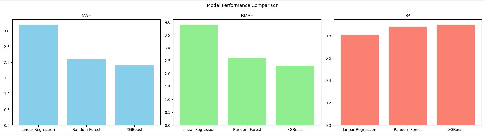
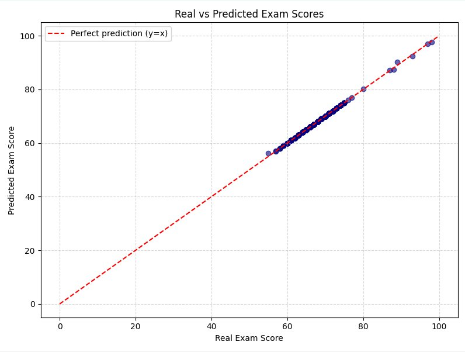

# 📐 Model Evaluation Metrics

When we train a Machine Learning model to **predict a numerical value** (like a student's exam score), we need concrete ways to measure how much the predictions are off. The three metrics used in this project are **MAE**, **RMSE**, and **R²**.

---

## MAE — Mean Absolute Error

### How it works

MAE calculates, on average, how much the model is off in absolute terms. For each student in the test set, we compute the difference between the real score and the predicted score, ignore the sign (positive or negative), and average all those errors.

```
MAE = average of |real_score - predicted_score|
```

### How to interpret it

MAE is in the **same unit as the variable you're predicting**. Since we're predicting scores from 0 to 100, a MAE of 1.9 means the model is off by 1.9 points per student on average.

- Low MAE → predictions are close to reality
- High MAE → predictions are consistently far off

### Practical example

If a student scored 72 and the model predicted 70.1, the error was 1.9. If another scored 65 and the model predicted 63.0, the error was 2.0. The MAE would be the average of these errors across all test students.

---

## RMSE — Root Mean Squared Error

### How it works

RMSE squares each error before averaging, then takes the square root. This means **large errors are penalized more heavily** than small ones.

```
RMSE = square_root( average of (real_score - predicted_score)² )
```

### How to interpret it

Like MAE, RMSE is in the same unit as the predicted variable. The difference is that it is **more sensitive to large errors**. If the model is accurate for most students but misses badly on a few, RMSE will increase more than MAE.

- RMSE close to MAE → errors are consistent, no extreme outliers
- RMSE much higher than MAE → the model makes a few very large errors

### Why does this matter?

In an educational context, a 1–2 point error is acceptable. But if the model predicts 70 for a student who scored 50, that 20-point error could lead to wrong support decisions. RMSE captures this concern better than MAE.

---

## R² — Coefficient of Determination

### How it works

R² measures **how much of the variation in scores the model is able to explain**. It compares the model's error against a naive baseline that simply predicts the average score for everyone.

```
R² = 1 - (sum of model errors² / sum of baseline errors²)
```

### How to interpret it

R² ranges from 0 to 1 (and can be negative for very poor models):

| R² | Interpretation |
|---|---|
| 1.0 | Perfect prediction — the model explains 100% of variation |
| 0.90 | Excellent — explains 90% |
| 0.75 | Good — explains 75% |
| 0.50 | Moderate — explains half the variation |
| < 0.50 | Weak — the model doesn't capture patterns well |
| 0 | Equivalent to always predicting the mean |
| < 0 | Worse than always predicting the mean |

---

## Model comparison

We trained three models and compared them across all three metrics:



| Model | MAE | RMSE | R² |
|---|---|---|---|
| Linear Regression | 3.2 | 3.9 | 0.81 |
| Random Forest | 2.1 | 2.6 | 0.88 |
| **XGBoost** | **1.9** | **2.3** | **0.90** |

XGBoost won on all three fronts: lowest average error (MAE), least penalization for large mistakes (RMSE), and best explanation of data variation (R²).

---

## Real vs. Predicted scores

The chart below plots the actual exam score against the model's prediction for each student in the test set. The red dashed line represents perfect prediction (y = x) — the closer the dots are to that line, the better the model.



The dots hug the diagonal very tightly, which visually confirms the strong R² of 0.90. The few students further from the line represent the cases where the model's MAE and RMSE come from.

---

## Comparing the metrics

| Metric | What it measures | Unit | Sensitive to large errors? |
|---|---|---|---|
| MAE | Average absolute error | Same as variable (points) | No — all errors have equal weight |
| RMSE | Average error penalizing extremes | Same as variable (points) | Yes — large errors weigh more |
| R² | How much variation the model explains | Dimensionless (0 to 1) | Indirectly |

In practice, the three metrics complement each other. MAE says "on average, how much did we miss." RMSE says "do we have cases of very large errors?" R² says "did the model actually learn the patterns, or is it just guessing the mean?"

---

## Why was XGBoost the best?

XGBoost is a **gradient boosting** algorithm — it builds many small decision trees in sequence, where each new tree learns to correct the errors of the previous ones. This makes it very effective on tabular data with mixed variables (numerical and categorical), exactly the case of our dataset.

Compared to Linear Regression, it captures non-linear relationships (for example, that studying a lot *and* sleeping poorly may be worse than studying a bit *and* sleeping well). Compared to Random Forest, the boosting process reduces errors more systematically over iterations.
